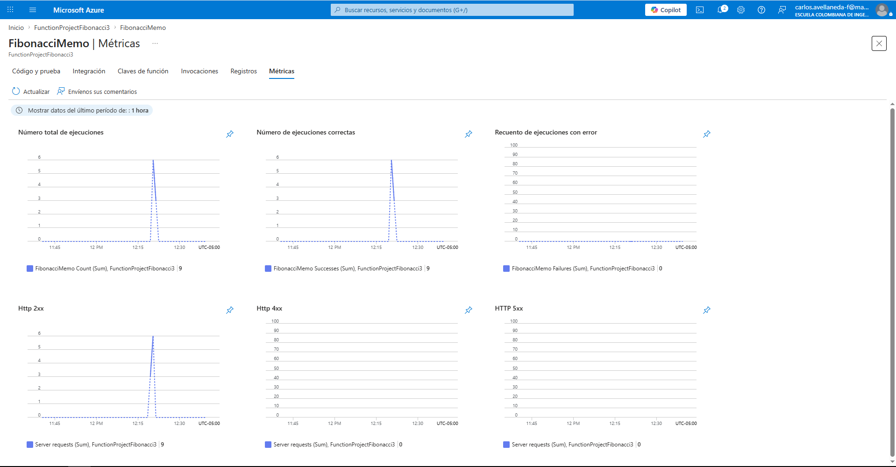

# Lab10-ARSW: Escalamiento Serverless en Azure con Azure Functions
Carlos Avellaneda
---

## Paso a Paso del Laboratorio

### **PASO 1: Preparación Inicial**
-  Crear una cuenta gratuita en Azure (https://azure.microsoft.com/es-es/free/students/)
-  Obtener $100 USD de crédito para 12 meses
-  Revisar documentación oficial de [Azure Functions](https://www.c-sharpcorner.com/article/an-overview-of-azure-functions/)
-  Instalar Visual Studio Code (si no lo tienes)
-  Tener Node.js instalado en tu máquina

### **PASO 2: Instalar Extensión de Azure Functions**
-  Abrir VS Code
-  Ir a la pestaña de Extensiones (Ctrl+Shift+X)
-  Buscar "Azure Functions"
-  Instalar la extensión oficial de Microsoft


-  Reiniciar VS Code si es necesario

### **PASO 3: Crear Function App en Azure Portal**
-  Abrir el portal de Azure (https://portal.azure.com)
-  Crear un nuevo recurso "Function App"
-  Configurar:
  - **Nombre del recurso**: nombre-unico-funcapp
  - **Grupo de recursos**: Crear nuevo o usar existente
  - **Runtime**: Node.js
  - **Versión**: 18 o superior
  - **Plan**: Consumption (Serverless)
  - **Storage Account**: Crear nuevo


-  Esperar a que se complete el despliegue
-  Anotar el nombre del Function App para pasos posteriores

### **PASO 4: Configurar Proyecto Local**
-  Abrir terminal en la carpeta `FunctionProject`
-  Ejecutar `npm install` para instalar dependencias
-  Verificar que la estructura de carpetas sea:
  ```
  FunctionProject/
  ├── Fibonacci/
  │   ├── function.json
  │   └── index.js
  ├── package.json
  ├── host.json
  └── proxies.json
  ```

### **PASO 5: Revisar y Entender la Función Actual**
-  Abrir [Fibonacci/index.js](Fibonacci/index.js)
-  Analizar el código de la función de Fibonacci
-  Entender: ¿Cuál es el enfoque usado? (iterativo, recursivo, etc.)
-  Revisar [Fibonacci/function.json](Fibonacci/function.json) para entender la configuración

### **PASO 6: Desplegar Función a Azure**
-  Buscar y ejecutar: "Azure Functions: Deploy to Function App"

-  Autenticarse con tu cuenta de Azure si se solicita
-  Seleccionar la Function App creada en PASO 3
-  Esperar a que se complete el despliegue

- Verificar el despliegue en el Azure Portal

### **PASO 7: Probar la Función en Azure Portal**
-  Ir a Azure Portal → Tu Function App → Fibonacci

-  Usar la sección "Code + Test"
-  Ejecutar con un valor de prueba (ej: `{"n": 10}`)
-  Verificar que retorna el resultado correcto
-  Anotar el tiempo de respuesta

### **PASO 8: Crear Colección POSTMAN/NEWMAN**
  - Abre Postman
  - Archivo → Import → Selecciona [postman_collection.json](postman_collection.json)
  - Verifica que las variables estén configuradas correctamente
  - Selecciona la request "Fibonacci"
  - Click en "Send"
  - Revisa la respuesta en la pestaña "Response"
  ```cmd
  npm install -g newman
  ```
  - Ejecutar con: `run_tests.bat`
  - Ejecutar con: `powershell -ExecutionPolicy Bypass -File run_tests.ps1`

### **PASO 9: Ejecutar Pruebas de Carga Concurrente**
  - Ejecutar pruebas: `newman run postman_collection.json --iteration-data test_data.csv --reporter-json-export newman-results.json`
  - CPU Usage
  - Memory Usage
  - Function Execution Count
  - Todas las peticiones respondieron? SI / NO
  - Tiempo promedio de respuesta
  - CPU máximo alcanzado

**Resultados obtenidos**:
- Número de peticiones: 10
- Tiempo promedio de respuesta: 129 ms
- Tiempo mínimo: 83 ms
- Tiempo máximo: 526 ms
- CPU máximo alcanzado: Por monitorear en Azure Portal
- Todas las peticiones respondieron: SI (10/10 exitosas)
- Errores registrados: 0
- Duración total: 2.5 segundos
- Observación: Primera petición fue más lenta (526ms), posteriores estables (83-89ms). Indica warm-up inicial de la Function App.

### **PASO 10: Crear Nueva Función con Memoization**
  ```javascript
  // Función con memoization recursiva
  const memo = {};
  
  function fibonacciMemo(n) {
    if (n <= 1) return n;
    if (memo[n]) return memo[n];
    memo[n] = fibonacciMemo(n - 1) + fibonacciMemo(n - 2);
    return memo[n];
  }
  
  module.exports = async function (context, req) {
    context.log('FibonacciMemo function processed request');
    const n = req.body?.n || 0;
    const result = fibonacciMemo(n);
    context.res = {
      body: { "result": result }
    };
  };
  ```

### **PASO 11: Pruebas de Memoization**

**Resultados obtenidos**:

**Endpoint probado**: `https://functionprojectfibonacci3-eyf2cechdzdsaaat.eastus2-01.azurewebsites.net/api/fibonaccimemo`

**Valor testeado**: n=35

**Estado Caliente (Warm)** - Instancia ya activa en memoria:
  - Llamada 1: 890.67 ms
  - Llamada 2: 164.04 ms
  - Llamada 3: 151.38 ms
  - Promedio warm: 402.03 ms
  - Observacion: la primera llamada refleja el cold start; las siguientes dos ya muestran la cache en memoria del proceso activo.

**Reinicio de Function App**: Se ejecuto `az functionapp restart` para simular cambio de instancia

**Estado Frio (Cold)** - Instancia despues de reinicio:
  - Llamada 1: 169.66 ms
  - Llamada 2: 153.82 ms
  - Llamada 3: 163.29 ms
  - Promedio cold: 162.26 ms
  - Observacion: después del reinicio los tiempos fueron estables y menores que el promedio warm.

  

**Analisis de Resultados**:
- Diferencia: el promedio cold fue 239.77 ms menor que el promedio warm.
- **Conclusion clave**: la memoization en memoria local no ofrece una mejora estable entre ciclos de vida de la app. El primer acceso carga el proceso y las siguientes invocaciones muestran mejor latencia mientras la instancia permanece viva.
- **Razon del comportamiento**: en serverless, la cache en RAM depende del proceso activo. Cuando la Function App se reinicia, la cache se pierde; aun así, el costo inicial del arranque puede dominar la primera medicion y hacer que el promedio warm quede por encima del cold.
- **Implicacion practica**: la memoization en memoria local no es confiable como persistencia entre instancias en Azure Functions. Si se necesita reutilizar estado entre ejecuciones, conviene usar una cache externa o distribuida.

## Preguntas Conceptuales a Responder

1. **¿Qué es un Azure Function?**
  - Respuesta: Un Azure Function es un servicio de computo serverless de Azure que permite ejecutar codigo en respuesta a eventos (HTTP, colas, timers, blobs, etc.) sin administrar servidores. El runtime de Functions se encarga de aprovisionamiento, escalado y ejecucion.

2. **¿Qué es Serverless?**
  - Respuesta: Serverless es un modelo de ejecucion donde el proveedor cloud administra la infraestructura. El desarrollador se enfoca en el codigo y paga por ejecucion/consumo, no por servidores encendidos permanentemente. No significa "sin servidores", sino "sin administrarlos directamente".

3. **¿Qué es el Runtime y qué implica seleccionarlo?**
  - Respuesta: El runtime es el entorno que ejecuta la funcion (Node.js, .NET, Python, Java, etc.). Seleccionarlo define lenguaje, version, compatibilidad de librerias, comportamiento del host y dependencias de deployment. Elegir mal el runtime puede causar errores de ejecucion o incompatibilidades.

4. **¿Por qué crear un Storage Account con un Function App?**
  - Respuesta: Azure Functions usa Storage Account para metadatos del host, coordinacion de triggers, logs, checkpoints y administracion interna de escalado. Por eso es un requisito de la plataforma incluso para funciones HTTP.

5. **¿Cuáles son los tipos de planes de Function App?**
  - **Consumption**: Escalado automatico por demanda, pago por ejecucion y tiempo de CPU/memoria consumidos, cold starts posibles.
  - **Premium**: Instancias pre-calentadas, menor latencia, escalado automatico, permite VNET y cargas mas exigentes.
  - **App Service Plan**: Recursos dedicados siempre activos, costo fijo por instancia, sin cold start por inactividad.
  - Diferencias, ventajas y desventajas: Consumption es economico para cargas variables pero tiene cold start; Premium reduce latencia y mejora performance con mayor costo; App Service Plan da control y estabilidad con costo fijo aunque haya poco trafico.

6. **¿Por qué falla la Memoization en Azure Functions?**
  - Respuesta: La memoization en memoria local depende del proceso actual. En Azure Functions (especialmente serverless), la instancia puede reciclarse, escalar horizontalmente a otras instancias o reiniciarse; por eso el cache en RAM no es persistente ni compartido. El resultado es que la optimizacion no siempre se conserva entre invocaciones.
   - Pista: Considera el ciclo de vida de la instancia

7. **¿Cómo funciona el sistema de facturación de Azure Functions?**
  - Respuesta: En Consumption se factura por numero de ejecuciones y por recursos consumidos (GB-s y tiempo de ejecucion), con un nivel gratuito mensual. En Premium/App Service se paga principalmente por instancias aprovisionadas (tiempo activo), ademas de consumo asociado.

## Referencias Útiles

- [Documentación oficial Azure Functions](https://learn.microsoft.com/es-es/azure/azure-functions/)
- [Getting Started with Azure Functions](https://www.c-sharpcorner.com/article/an-overview-of-azure-functions/)
- [Newman CLI for Postman](https://learning.postman.com/docs/running-collections/using-newman-cli/command-line-with-newman/)

---

